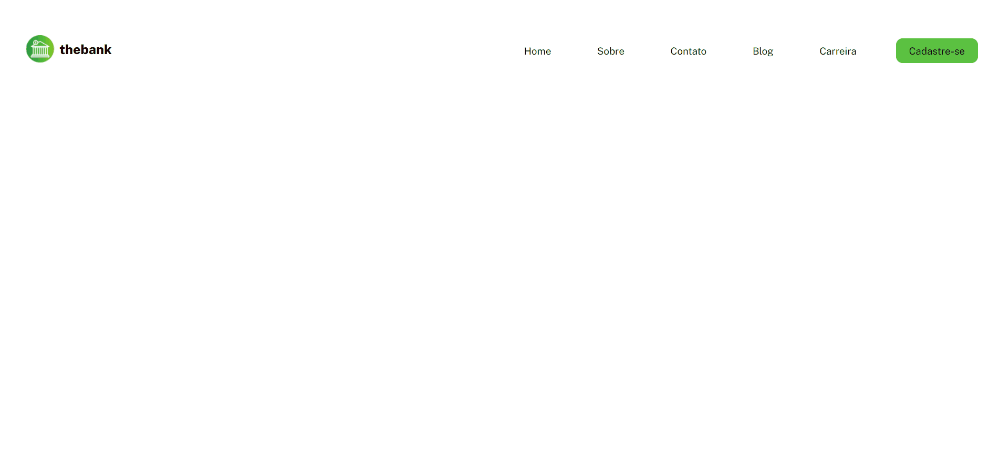
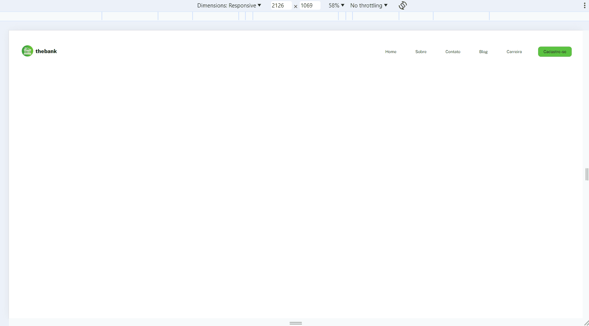

# Menu com Flexbox
Oi Devs tudo bem com vocês ! 😁 estou aqui trazendo mais um exercício dos meus estudos, dessa vez um menu com flexbox, que simula o cabeçalho de um site de banco, esse exercício foi passado pelo curso Dev-Quest ainda é bem simples mas já serviu muito para eu praticar e enteder o flexbox, e também a responsividade. Tive algumas dificuldades na questão da responsividade levei umas 3 horas para finalizar esse exercício logo abaixo terão uns gifs mostrando o resultado. Obrigado por ler !

## Tecnologias utilizadas:
- HTML
- CSS